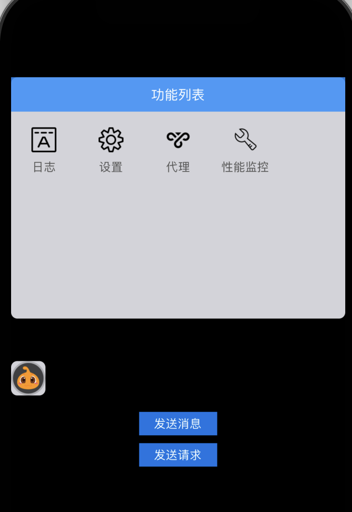
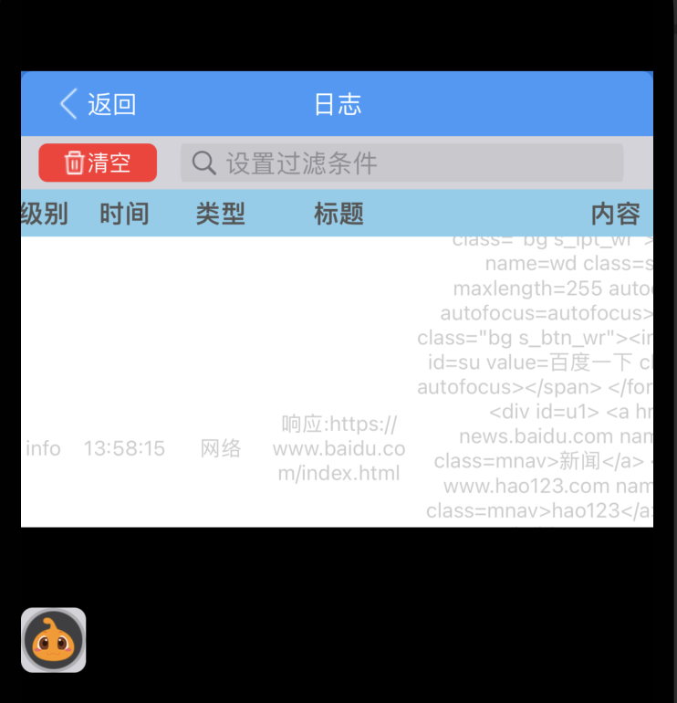
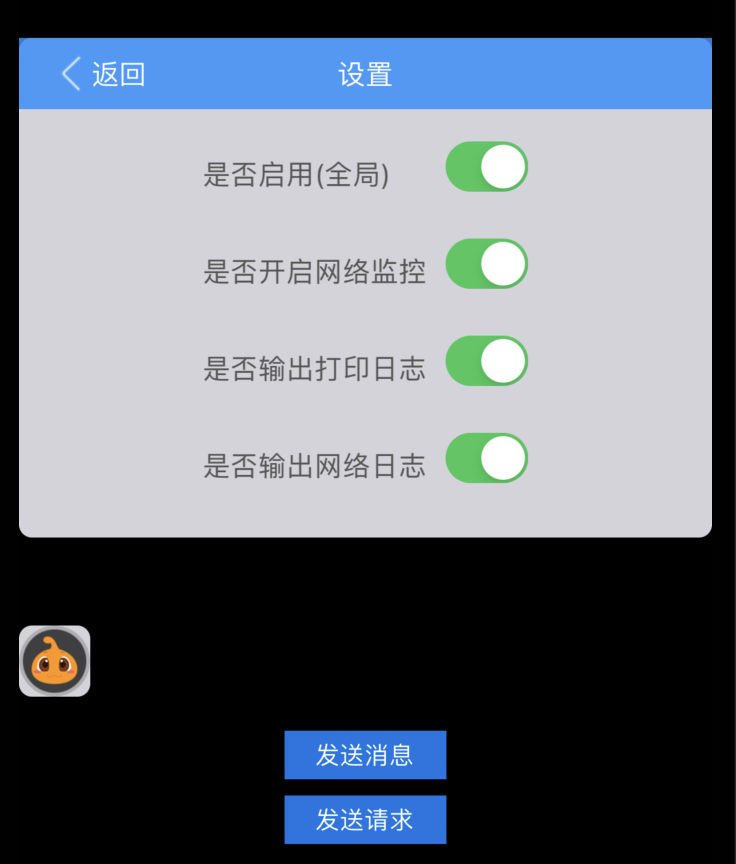
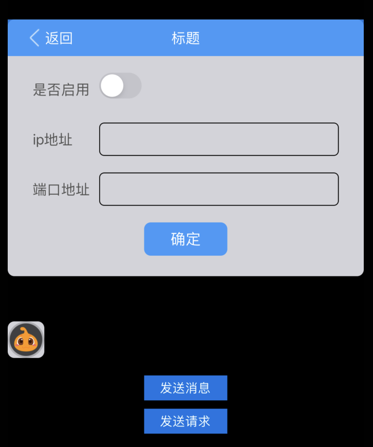
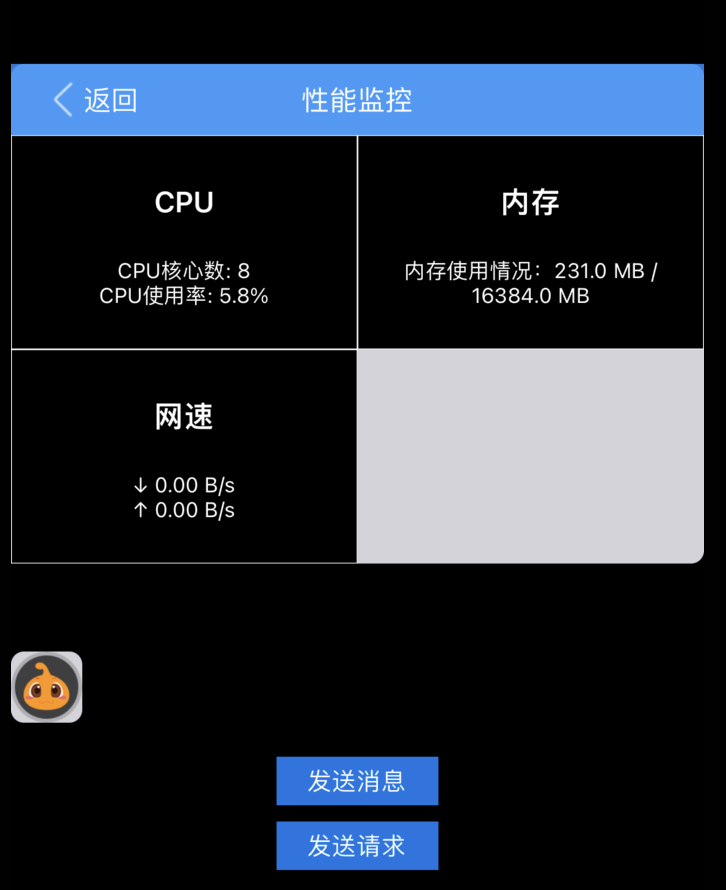

# SwiftDebug
> SwiftDebug1.0 是一个方便游戏过程中测试的组件，功能包括
>
> - 入口及面板支持拖动
>
> - 日志展示
> - 网络请求捕获
> - 系统性能监控（网速、CPU、内存）
> - 网络代理
### 1. 使用方法

```swift
import SwiftDebug
SwiftDebug.install()
```

*点击悬浮球可以显示/隐藏面板*

### 2. 功能截图

- 功能列表

  

- 日志

  

- 设置

  

- 代理

  

- 性能监控


